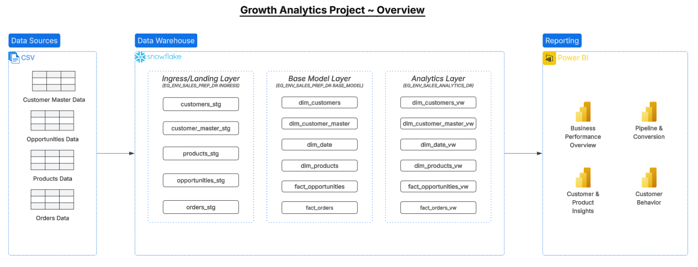
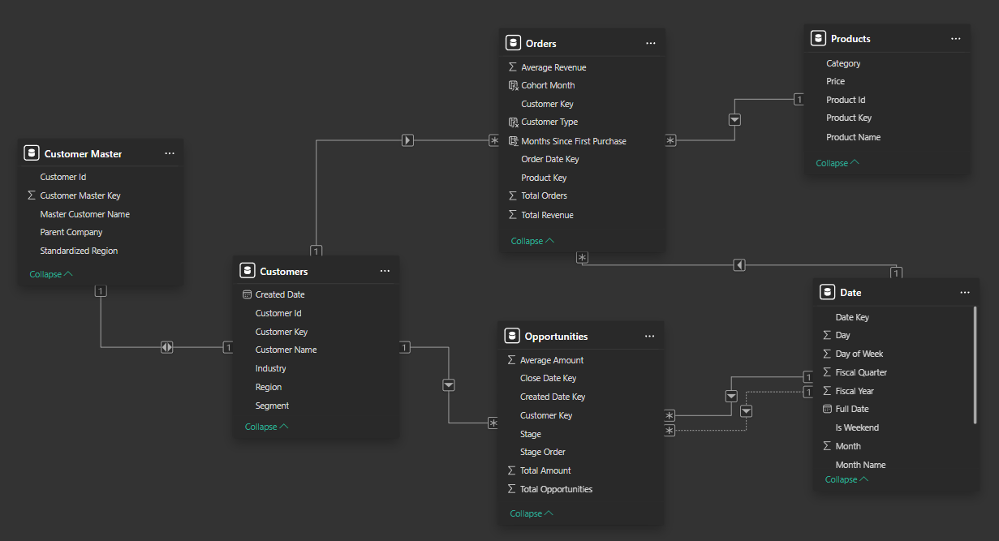
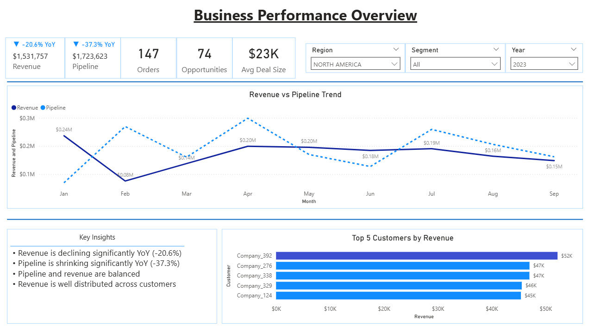
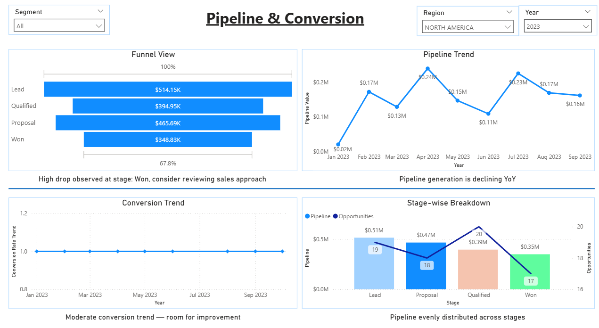
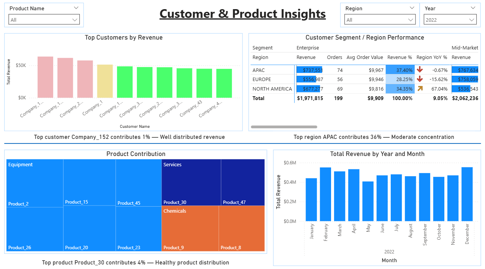
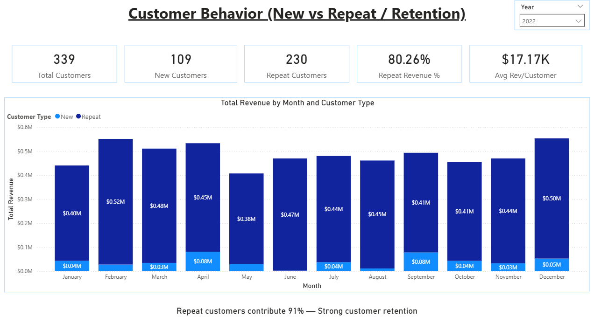

# 📊 B2B Sales Analytics Dashboard (Snowflake + Power BI)

## 🔍 Project Overview
This project delivers an end-to-end analytics solution to evaluate **revenue performance, pipeline health, customer concentration, and retention trends** for a B2B sales environment.  

The solution uses **Snowflake** for data modeling and transformation, and **Power BI** for building an executive-ready dashboard with actionable insights.

---

## 🎯 Business Problem
Sales leadership often lacks a unified view of:
- Revenue trends and YoY performance  
- Pipeline health and conversion efficiency  
- Customer and product contribution  
- Customer retention vs acquisition  

This project addresses these gaps by creating a **structured data model and interactive reporting layer**.

---

## 🛠️ Tech Stack
- **Data Warehouse:** Snowflake  
- **Transformation:** SQL (modular)  
- **Visualization:** Power BI  
- **Modeling:** Star Schema (Dimensions & Facts)  

---

## 🧱 Data Model

The data model follows a **star schema design** for scalability and performance.

### 🔹 Dimension Tables
- `DIM_CUSTOMERS` – Customer details  
- `DIM_CUSTOMER_MASTER` – Parent/standardized customer hierarchy  
- `DIM_PRODUCTS` – Product catalog  
- `DIM_DATE` – Calendar and fiscal attributes  

### 🔹 Fact Tables
- `FACT_ORDERS` – Revenue transactions  
- `FACT_OPPORTUNITIES` – Sales pipeline data  

### 🔑 Key Features
- Surrogate keys for all dimensions  
- Conformed dimensions across facts  
- Date keys used for time-based analysis  

---

## ⚙️ Data Pipeline

### SQL scripts:
- 00_create_db_roles_warehouses.sql
- 01_create_staging_tables.sql
- 02_create_file_formats_and_stages.sql
- 03_load_data_into_staging.sql
- 04_data_quality_checks.sql
- 05_create_base_model_tables.sql
- 06_load_base_model_sproc.sql
- 07_base_model_qa_tests.sql
- 08_analytical_views.sql
- 09_analytical_views_qa.sql

### Flow:
1. Raw CSV data → Snowflake Stage  
2. Loaded into **staging tables (INGRESS)**  
3. Cleaned & transformed → **BASE_MODEL**  
4. Business-ready views → **ANALYTICS layer**  
5. Connected to Power BI  

📌 *Refer to `/docs/DataMapping.xlsx` for data mapping document*

---

## 🧹 Data Quality Handling

The dataset intentionally includes real-world issues. The pipeline addresses:

- Duplicate records → handled via `MERGE` logic  
- Missing/null values → standardized defaults  
- Inconsistent formats → cleaned (dates, strings)  
- Invalid relationships → filtered or corrected  
- Surrogate key generation for consistency  

---

## 📈 Dashboard Overview

The Power BI dashboard is designed for **executive consumption** with clear storytelling and minimal clutter.

---

### 🔹 1. Business Performance Overview
- Revenue, Orders, Pipeline KPIs  
- Revenue vs Pipeline trend  
- Top customers by revenue  
- Key business insights  

---

### 🔹 2. Pipeline & Conversion
- Funnel analysis (stage drop-offs)  
- Pipeline trend (created date)  
- Conversion trend (close date)  
- Stage-level bottleneck identification  

---

### 🔹 3. Customer & Product Insights
- Top customers and concentration risk  
- Product/category contribution  
- Regional performance analysis  

---

### 🔹 4. Customer Behavior
- New vs Repeat customer revenue  
- Retention indicators  
- Customer value insights  

---

## 🚀 How to Run

1. Upload CSV files to Snowflake stage  
2. Execute SQL scripts in order (`00 → 09`)  
3. Validate data using QA scripts  
4. Open Power BI file  
5. Connect to Snowflake analytics views  

---

## 📌 Key Highlights

- End-to-end data pipeline (raw → insights)  
- Realistic dataset with data quality challenges  
- Scalable star schema design  
- Business-focused dashboard with dynamic insights  
- Strong emphasis on **storytelling + decision-making**  

---
